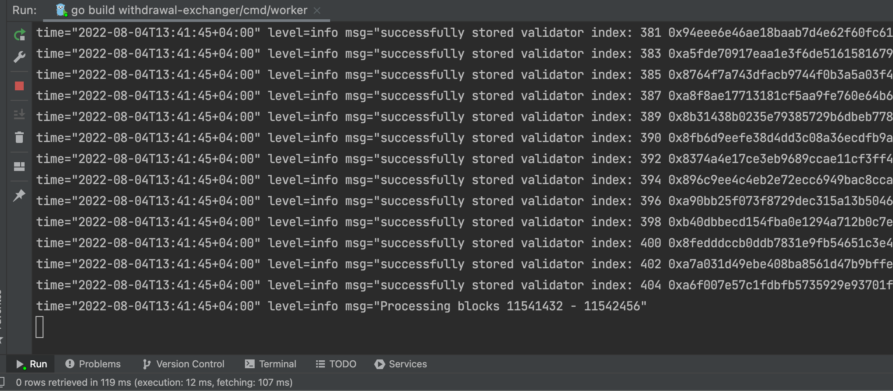
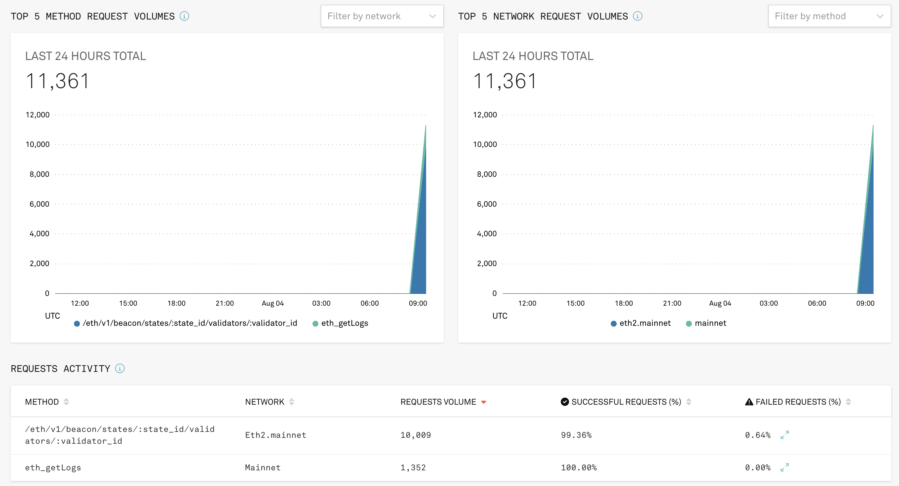
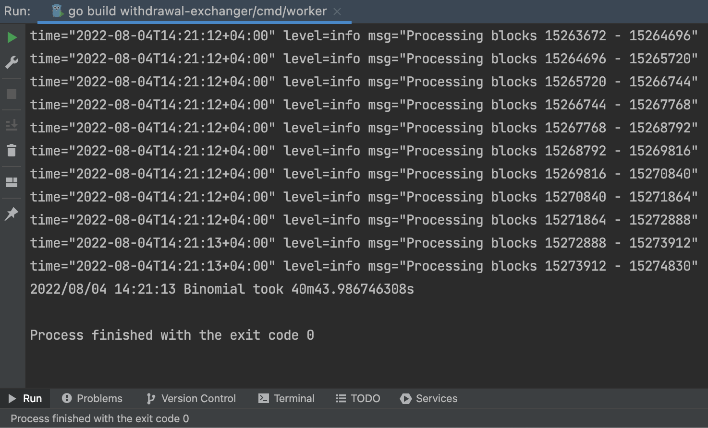

# Searcher 0x00 -> 0x01 withdrawal credential validator candidates

## Description
Bot searches node operators with withdrawal credential address 0x00

The strategy is:

- Prepare blocks for scanning aka "bullets"
- Fetch event logs by range block_from...block_to 
- FilterData by WC address
- Exchange pubKey to validator index
- Store into DB 

## How to install and run script
```bash
1. git clone git@github.com:block3man/withdrawal-exchanger.git
2. cp .env.sample to .env, set up .env with your creds
3. make tools - generates migrate tool for postgres
4. make vendor
5. make up - this step starts postgres container
6. make migrate
7. go run cmd/worker/main.go 
8. Then you can store database in docker
      8.1 docker exec -it wc-exchange-postgres  ash
      8.2 mkdir postgres
      8.3 cp -R /var/lib/postgresql/data/pgdata/* postgres
      8.4 exit
      8.5 docker container commit wc-exchange-postgres <your docker account>/wc-exchange-postgres:mainnet
      8.6 docker push <your docker account>/wc-exchange-postgres:mainnet
9 Share your own docker image with data. Also, you have to set pg's PGDATA=postgres
      9.1 You can find an example here - docker-compose-pg-with-data.yml
```

## How to get fetched data and don't run a script?
```bash
1. make up-with-data
```

## Available variables

| Vars in env                         |                           Default - Raw                            | Description                                                                                             |
| ----------------------------------- | :----------------------------------------------------------------: | :------------------------------------------------------------------------------------------------------ |
| INFURA_KEY (required)               |                               `None`                               | Your personal infura key                                                                                |
| INFURA_PROJECT_ID (required)        |                               `None`                               | Project ID in infura                                                                                    |
| INFURA_PROJECT_SECRET (required)    |                               `None`                               | Project Secret in infura                                                                                |
| INFURA_EHT2_HOST (required)         |                  `eth2-beacon-mainnet.infura.io`                   | INFURA_EHT2_HOST                                                                                        |
| DEPOSIT_CONTRACT_ADDRESS (required) |            `0x00000000219ab540356cbb839cbe05303d7705fa`            | DEPOSIT_CONTRACT_ADDRESS                                                                                |
| WITHDRAWAL_CREDENTIALS (required)   | `009690e5d4472c7c0dbdf490425d89862535d2a52fb686333f3a0a9ff5d2125e` | WITHDRAWAL CREDENTIALS. For example lido's ws                                                           |
| FROM_BLOCK (required)               |                              11052984                              | First block from bot scans blocks                                                                       |
| TO_BLOCK (required)                 |                              `Latest`                              | [Look latest block on ethscan](https://etherscan.io/address/0x00000000219ab540356cbb839cbe05303d7705fa) |
| STEP                                |                               `1024`                               | Step - How many block bot'll fetch block per one time.                                                  |
| PG_PORT                             |                               `5432`                               |                                                                                                         |
| PG_HOST                             |                            `localhost`                             |                                                                                                         |
| PG_USERNAME                         |                             `postgres`                             |                                                                                                         |
| PG_PASSWORD                         |                             `postgres`                             |                                                                                                         |
| PG_DATABASE                         |                              `master`                              |                                                                                                         |
| PG_SCHEMA                           |                              `public`                              |                                                                                                         |
| PG_SSLMODE                          |                             `disable`                              |                                                                                                         |






